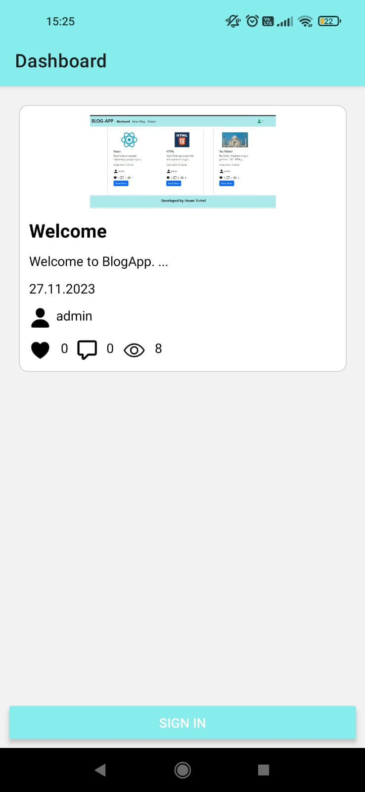
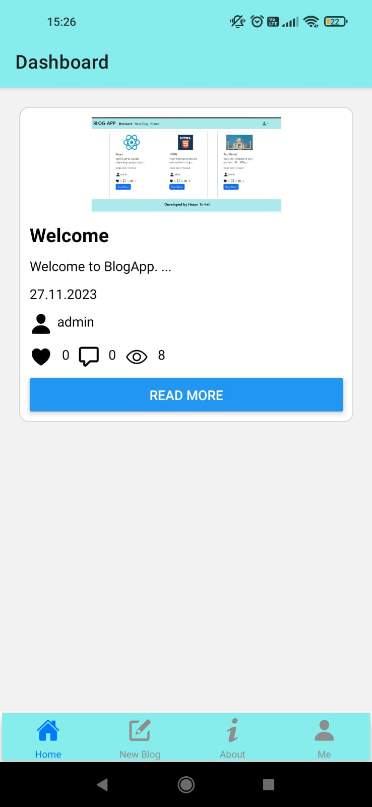
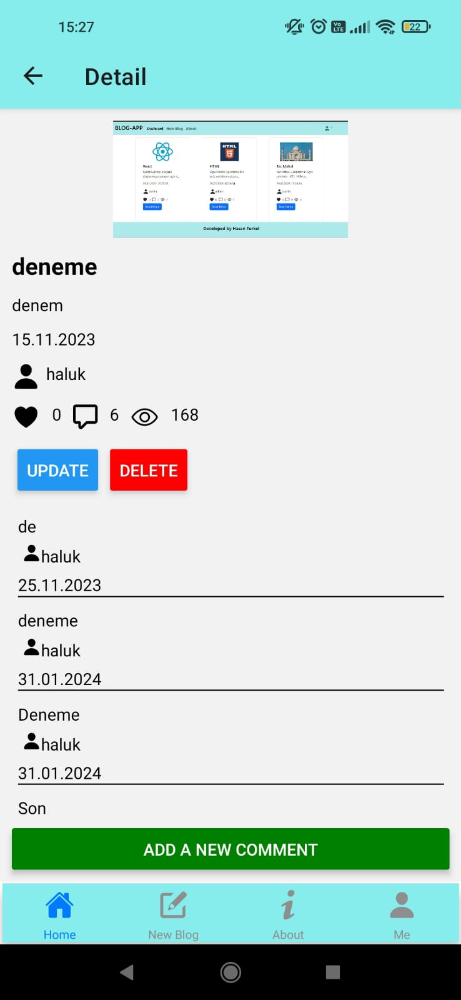
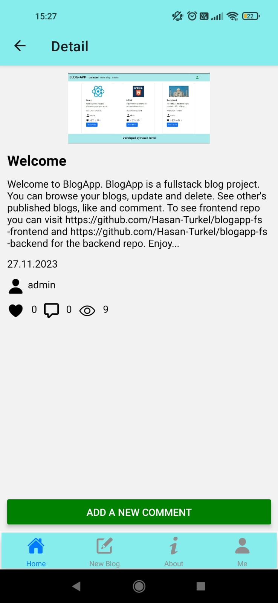
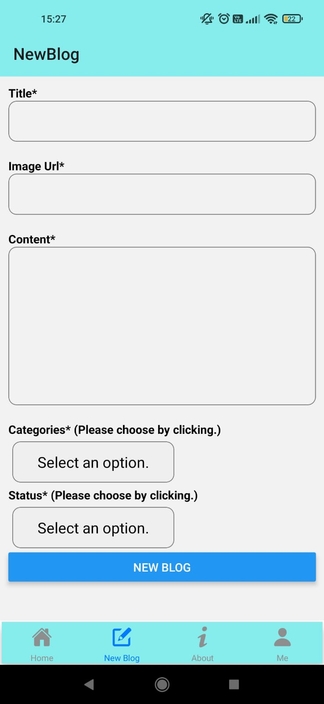
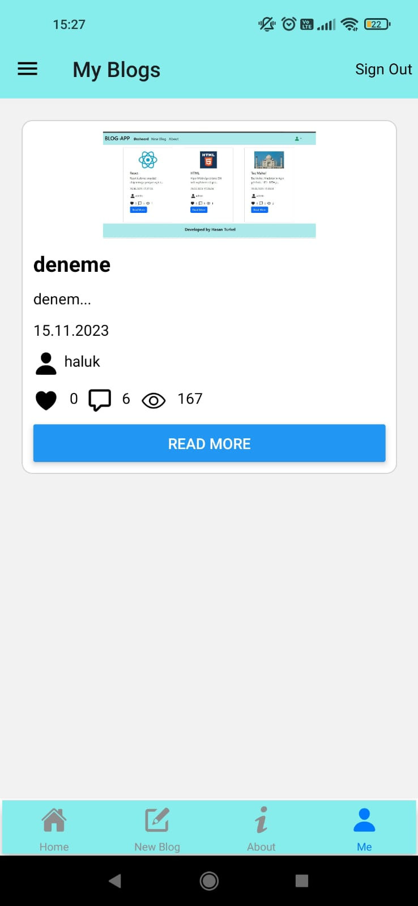

# native-blogapp

This repo is the native app of fullstack blogapp. Blog app is a project that you can see, like and comment other's blogs, you can create your blog, update and delete.
To see web repo you can visit [blogapp-fs-frontend repo.](https://github.com/Hasan-Turkel/blogapp-fs-frontend) and for the backend repo  [blogapp-fs-backend repo.](https://github.com/Hasan-Turkel/blogapp-fs-backend).

## This is how the app looks like.

      

